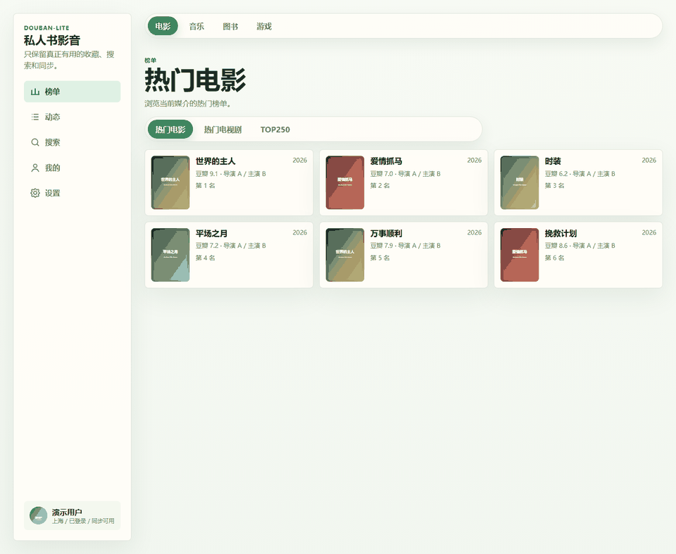
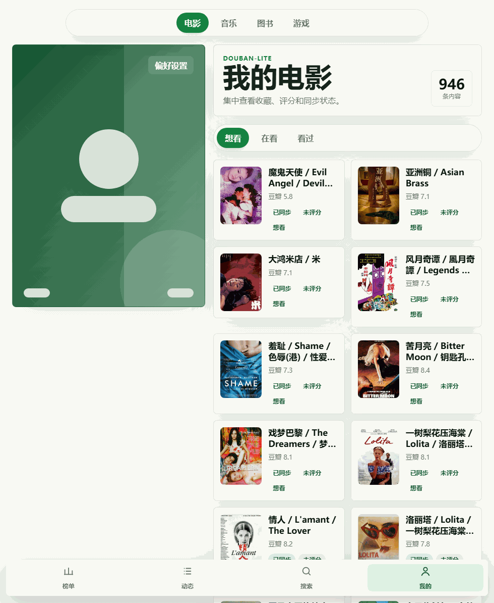
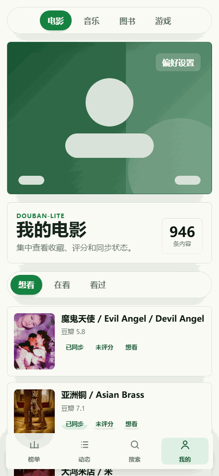

# douban-lite

`douban-lite` 是一个轻量的豆瓣 PWA，适合自托管使用。一个部署实例可以支持多人使用，但每个人都应导入自己的豆瓣 Cookie，彼此的收藏、评分、标签、短评、动态和同步任务会分开存储。

> 提醒
> `douban-lite` 需要接收真实登录态的豆瓣 Cookie，并代替用户发起登录后的豆瓣请求。这类行为可能触发豆瓣风控，例如登录校验、Cookie 失效、临时限流，或账号侧的安全验证。最稳妥的使用方式是自己部署、自己使用。不要把它当成公开 SaaS，也不要让别人把高权限的真实豆瓣 Cookie 粘贴到他们无法控制的第三方实例里。

## 功能说明

- 支持 `电影`、`音乐`、`图书`、`游戏`
- 支持搜索豆瓣条目并进入详情页
- 支持保存个人状态，包括收藏状态、评分、短评、标签和是否同步到动态
- 支持把每个用户自己的豆瓣收藏同步到本地 SQLite
- 支持查看当前登录用户的豆瓣动态
- 支持共享公共缓存，例如条目数据和榜单快照
- 支持作为 PWA 安装到手机和桌面端

## 页面截图

以下截图基于本地页面渲染整理。

- 功能总览 GIF 覆盖 `榜单 / 搜索 / 详情 / 我的 / 动态 / 设置`
- `Pad` 和手机端同样提供了整套功能页轮播
- 需要登录态的页面使用本地演示数据展示界面结构
- 所有截图均在等待 10 秒、确认主要内容完成加载后截取

### 功能总览

#### PC 端



#### Pad 端



#### 手机端




## 多用户模型

- v1 没有单独的 douban-lite 用户名和密码体系
- 用户通过导入自己的豆瓣 Cookie 登录
- 后端会校验 Cookie，解析对应的豆瓣 `peopleId`，创建或更新本地用户，并写入 httpOnly 会话 Cookie
- 后续请求使用的是 douban-lite 自己的会话 Cookie，而不是浏览器里原始的豆瓣 Cookie

### 数据隔离

- 按用户隔离的数据：
  `user_items`、`douban_sessions`、`timeline_snapshots`、`sync_jobs`、`sync_events`
- 所有用户共享的数据：
  `subjects`、`ranking_snapshots`

## 本地开发

环境要求：

- `Node.js >= 24`
- `npm >= 11`

安装并启动：

```bash
npm install
npm run dev
```

默认地址：

- Web: `http://localhost:5173`
- API: `http://localhost:8787`

Vite 开发服务器会把 `/api` 和 `/health` 代理到 API 服务。

## 环境变量

项目不会自动加载根目录 `.env` 文件，请通过 shell、进程管理器或部署平台注入变量。

- `PORT`：API 端口，默认 `8787`
- `WEB_ORIGIN`：独立前端域名场景下用于配置 CORS
- `DATA_DIR`：SQLite 数据目录
- `WEB_DIST_DIR`：前端构建目录，默认 `./apps/web/dist`
- `APP_SECRET`：生产环境必填，用于 douban-lite 会话签名和豆瓣 Cookie 加密
- `SESSION_TTL_DAYS`：douban-lite 会话有效期，默认 `30`
- `DOUBAN_PUBLIC_BASE_URL`：豆瓣公开 / 移动端页面基地址
- `DOUBAN_WEB_BASE_URL`：豆瓣登录态 Web 页面基地址
- `SYNC_INTERVAL_HOURS`：定时同步间隔小时数
- `DISABLE_AUTO_SYNC`：设为 `true` 时关闭定时同步
- `VITE_API_BASE_URL`：前端 API 地址，留空时使用同源 `/api`
- `VITE_API_PROXY_TARGET`：本地 Vite 代理目标，默认 `http://localhost:8787`

## 常用命令

```bash
npm run typecheck
npm test
npm run build
npm start
```

`npm start` 会在 `npm run build` 之后由 API 进程托管前端构建产物。

## 用户如何登录

1. 打开部署后的应用。
2. 进入 Settings 页面。
3. 粘贴已登录豆瓣浏览器里的 Cookie，例如 `dbcl2=...; ck=...;`。
4. 后端会校验 Cookie，并把当前会话绑定到对应豆瓣账号的 `peopleId`。
5. 浏览器收到 douban-lite 的会话 Cookie 后，会在当前设备上保持登录，直到过期或主动退出。

退出登录只会删除当前浏览器里的 douban-lite 会话 Cookie，不会删除服务端存储的该用户豆瓣会话记录。

## 如何获取 Cookie / 在 PWA 中重新登录

1. 在桌面 Chrome 或 Edge 中打开任一已登录的豆瓣页面。
2. 按 `F12` 打开开发者工具，进入 `Application` 或 `Storage`，再打开 `Cookies` 下的 `douban.com`。
3. 把需要的 Cookie 拼成 `name=value; name2=value2;` 的格式，例如 `dbcl2=...; ck=...;`。
4. 回到 douban-lite 的 `Settings` 页面，粘贴 Cookie，点击 `导入并登录`。
5. 如果后续会话失效、同步失败或豆瓣要求重新验证，重新回到浏览器复制最新 Cookie，再次导入即可。

注意事项：

- PWA 不会直接继承系统浏览器里的豆瓣登录态，因此安装到桌面或手机主屏后仍需要手动导入一次 Cookie。
- 只应在你自己信任的自部署实例中粘贴 Cookie。
- 导入成功后，浏览器保存的是 douban-lite 自己的 httpOnly 会话，不需要长期保留原始豆瓣 Cookie。

## 部署说明

仓库内已经包含 `render.yaml`，可用于部署 Node Web Service。

重要限制：

- SQLite 必须放在持久化存储上，才适合真实的多用户使用
- Render Free 的本地文件系统不适合长期保存共享数据
- 生产环境必须启用 HTTPS
- 生产环境必须配置 `APP_SECRET`

如果要给多人共享使用，建议：

- 选择带持久化磁盘的托管方案，或者后续迁移到外部数据库
- 只把访问地址分享给你信任的人
- 能自己部署自己用，就尽量不要做成公开或半公开部署

## 安全说明

- 最安全的方式仍然是自己部署、自己使用，部署者和豆瓣账号所有者是同一个人时风险最低
- 不要把自己的豆瓣 Cookie 粘贴到你无法控制的第三方部署实例
- 登录后抓取和同步行为可能触发豆瓣风控、会话失效或额外验证
- 豆瓣 Cookie 本质上就是登录凭证，必须按敏感信息处理
- 豆瓣 Cookie 在服务端会通过 `APP_SECRET` 加密存储
- douban-lite 使用 httpOnly 会话 Cookie，因此前端在登录后不需要继续持有原始豆瓣 Cookie
- 公共或共享部署依然属于敏感环境，因为用户导入的是真实豆瓣登录态

## License

GPL-3.0-only. See [LICENSE](./LICENSE).
